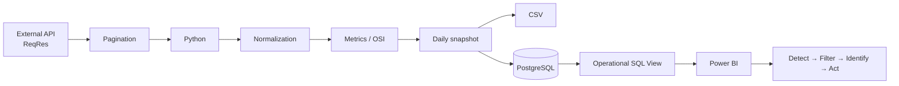
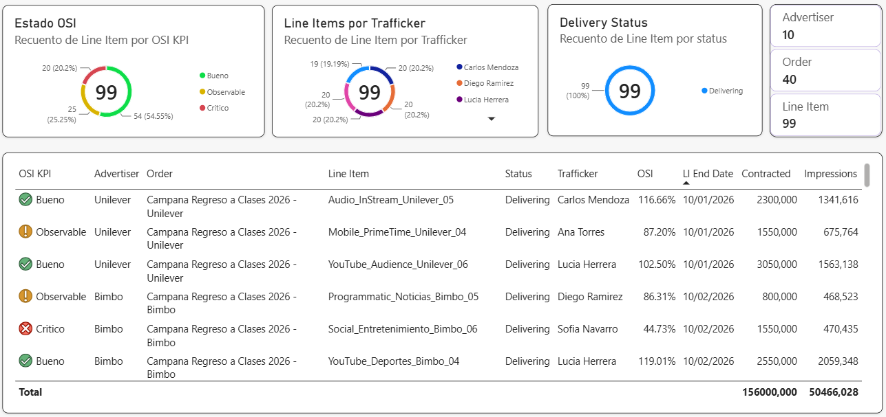
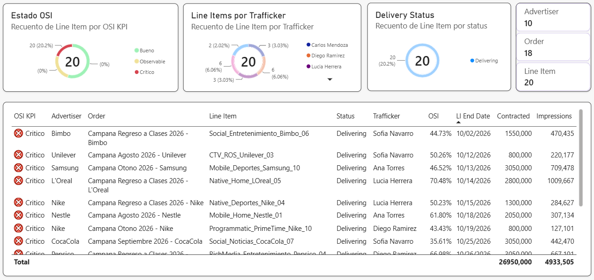

# Campaign Monitor

Operational monitoring solution for identifying advertising Line Items whose delivery is deviating from their expected pace and helping operations teams move from detection to action.

> Portfolio project built with synthetic demo data. The workflow and business logic reproduce a realistic campaign-monitoring scenario without exposing production or client data.

## The problem

In campaign operations, knowing what happened is not enough.

A campaign may still be active and delivering impressions while already falling behind the pace required to meet its contracted delivery by the end date.

Reviewing campaigns individually makes it difficult to identify where attention is required, understand who is responsible and prioritize operational action.

Campaign Monitor was built to make that process observable and actionable.

## The solution

Campaign Monitor retrieves Line Item data from an external API, normalizes it into a stable internal model and applies campaign pacing logic.

The processed state is persisted as a daily snapshot in PostgreSQL. An operational SQL view classifies the latest state of each Line Item and provides the data layer consumed by Power BI.

The resulting workflow allows the user to move from:

**detect → filter → identify → act**

## Architecture



## The operational signal: OSI

OSI (On Schedule Indicator) represents the delivery health of a Line Item by comparing how much of its contracted delivery has been completed with how much of its scheduled time has elapsed.

An OSI close to 100% indicates that delivery is progressing in line with time. A lower OSI signals that delivery is falling behind its expected pace and may require attention.

The purpose of the metric is not only to describe campaign performance, but to identify potential delivery risks early enough for an operations team to investigate and act.

## Operational monitor

Power BI provides the operational layer of the solution.

The monitor allows users to:

- see the overall distribution of Line Items by delivery health;
- identify critical or observable Line Items;
- filter the monitor by OSI status or trafficker;
- identify the campaigns and Line Items requiring attention;
- review the operational context needed to investigate them.

The operational flow is:

**detect a pacing problem → isolate affected campaigns → identify the relevant Line Items → understand ownership → act**

### Monitor overview



### Critical Line Items

Filtering by critical OSI isolates the Line Items that require operational attention.



## Design decisions

### Daily rather than real-time monitoring

Campaign Monitor is designed for daily operational monitoring rather than real-time reporting.

Each execution analyzes data closed through the previous day (D-1). The relevant time granularity is therefore daily rather than hourly.

### Idempotent daily persistence

Because the source state represents data closed through D-1, running the pipeline twice during the same day should not create two different snapshots of the same information.

The persistence layer therefore keeps one snapshot per Line Item and snapshot date. If the pipeline runs again during the same day, existing records are detected and skipped.

### Stable internal data model

Source-specific data is normalized into an internal Campaign Monitor model before business metrics are calculated.

This separates data acquisition from business logic and allows the processing layer to remain stable if the external source changes.

### CSV and PostgreSQL

CSV provides a simple and transparent output for inspecting and validating the processed dataset.

PostgreSQL provides the persistent layer for daily snapshots and a structured data source for the monitoring layer.

## Demo data

The project uses synthetic campaign data created specifically for demonstration purposes.

The dataset reproduces healthy, observable and critical delivery situations so the operational behavior of the monitor can be demonstrated without exposing client or production information.

OSI and its operational classification are calculated by the pipeline; they are not predetermined results stored in the source dataset.

## Current scope

Campaign Monitor v1 demonstrates an end-to-end operational workflow:

**API → Python → business logic → daily persistence → SQL semantic layer → Power BI operational monitoring**

The current version focuses on the latest closed delivery state rather than real-time monitoring or historical trend analysis.

A possible future evolution would be to incorporate daily delivery data to analyze pacing trends and evaluate how operational adjustments affect subsequent delivery.

## Setup

### 1. Create and activate a virtual environment

```powershell
python -m venv .venv
.venv\Scripts\Activate.ps1
```

### 2. Install dependencies

```powershell
pip install -r requirements.txt
```

### 3. Configure environment variables

Create a `.env` file in the project root:

```text
REQRES_API_KEY=your_api_key
POSTGRES_PASSWORD=your_postgres_password
```

### 4. Prepare PostgreSQL

With PostgreSQL installed and running:

1. Connect to the `postgres` database.
2. Run `sql/create_database.sql`.
3. Connect to the new `campaign_monitor` database.
4. Run `sql/schema.sql`.
5. Run `sql/create_monitor_view.sql`.

### 5. Run Campaign Monitor

```powershell
python main.py
```